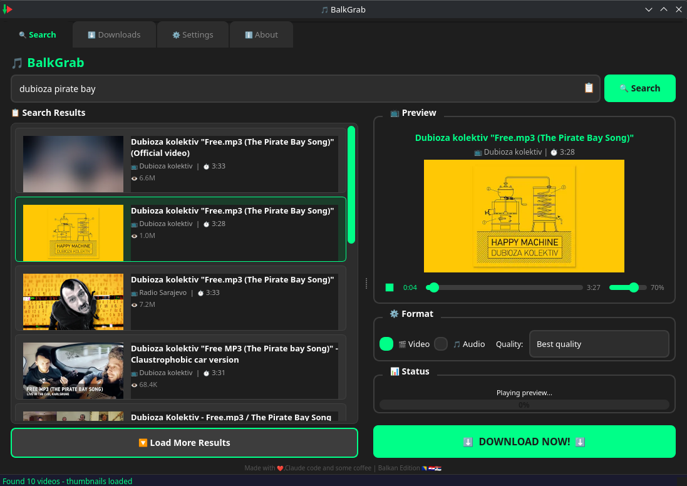
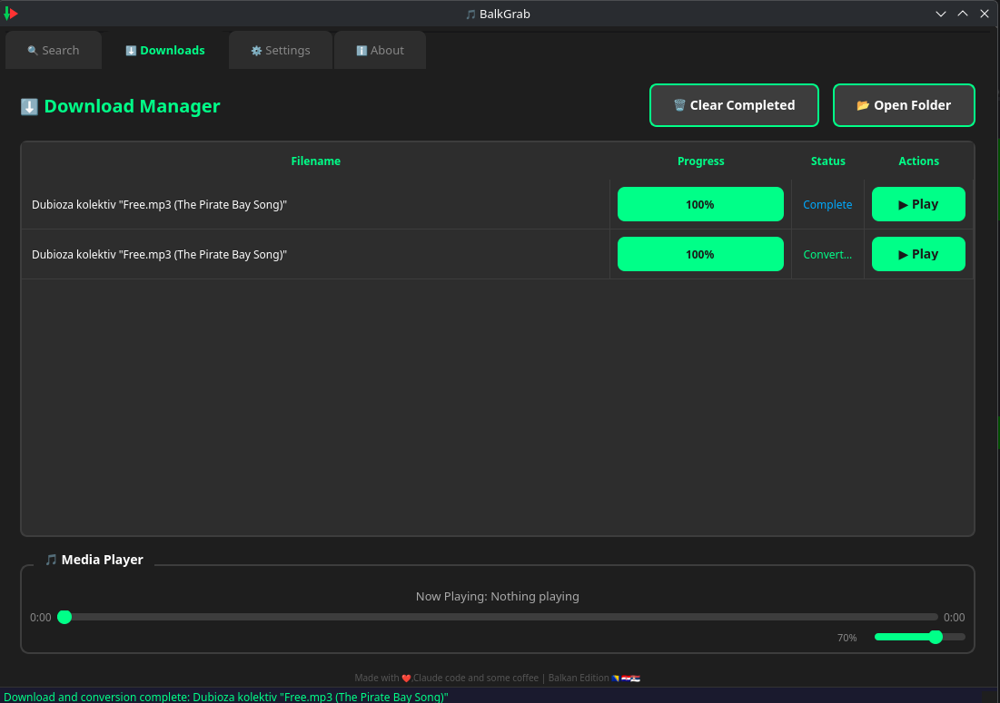
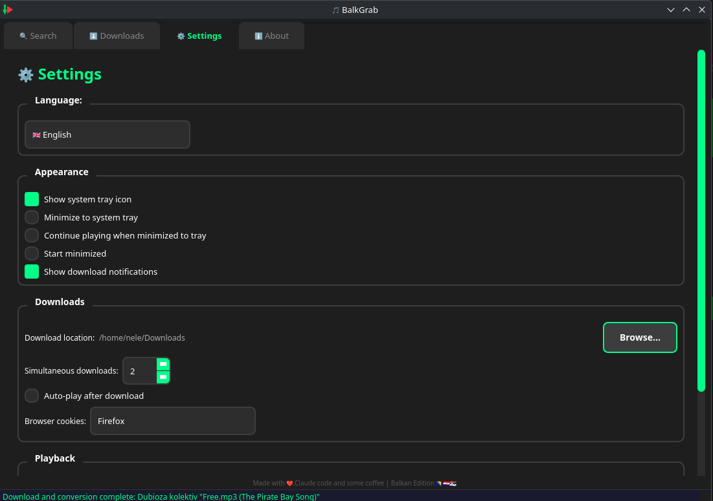
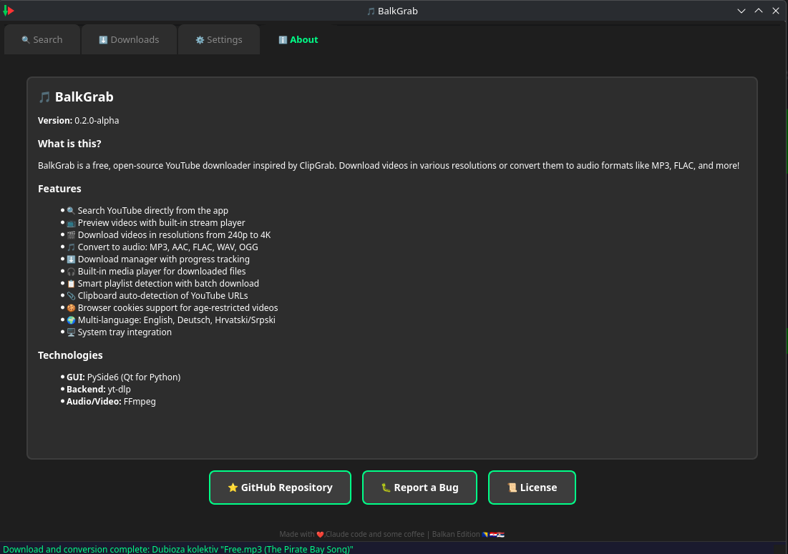

<p align="center">
  
</p>

<h1 align="center">BalkGrab</h1>

<p align="center">
  <strong>Free & Open Source YouTube Downloader</strong><br>
  <em>Inspired by ClipGrab - Made for the Balkans</em>
</p>

<p align="center">
  
  
  
  
  
  <br>
  
</p>

---

## Screenshots

| Search & Preview | Downloads |
|:---:|:---:|
|  |  |

| Settings | About |
|:---:|:---:|
|  |  |

---

## Features

- **YouTube Search** - Search directly from the app
- **Direct URL Support** - Paste any YouTube link
- **Playlist Support** - Load and batch download playlists
- **Clipboard Detection** - Auto-detects YouTube URLs from clipboard
- **Live Preview** - Stream and preview before downloading
- **Video Downloads** - 4K, 2K, 1080p, 720p, 480p, 360p, 240p
- **Audio Downloads** - MP3, AAC, FLAC, WAV, OGG with conversion
- **Built-in Media Player** - Play downloaded files instantly
- **File Conversion** - Right-click to convert downloaded files (MP3, MP4, FLAC, WAV, OGG, AAC)
- **Multi-Language** - English, Deutsch, Hrvatski/Srpski
- **Dark Theme** - Modern UI with system tray support
- **Browser Cookies** - Auto-detect browser for age-restricted content

---

## Installation

### Linux (Recommended)

Download `BalkGrab-linux-x86_64.tar.gz` from the [Releases](https://github.com/NeleBiH/BalkGrab/releases) page:

```bash
tar xzf BalkGrab-linux-x86_64.tar.gz
cd BalkGrab
./setup_BalkGrab.sh
```

Choose **1) Install / Update** from the menu. The setup script will:
- Detect your distro and install system dependencies (`python3`, `ffmpeg`) via `pacman` / `apt` / `dnf` / `zypper` / `xbps` / `emerge` / `apk`
- Create a Python virtualenv at `~/.balkgrab/.venv` and install `PySide6`, `yt-dlp`, `requests`
- Copy `BalkGrab.py` to `~/.balkgrab/` and create a launcher
- Install icons and create a menu entry (works on GNOME, KDE, XFCE, MATE, Cinnamon, LXDE and others)
- Install deno (needed for YouTube downloads)

After installation, find **BalkGrab** in your application menu or run `~/.balkgrab/balkgrab`.

**Updating** is just as easy - run `./setup_BalkGrab.sh` again and choose **1) Install / Update**. Your settings and download history are always preserved.

### Linux - Portable AppImage

Download the `.AppImage` file from the [Releases](https://github.com/NeleBiH/BalkGrab/releases) page:

```bash
chmod +x BalkGrab-*.AppImage
./BalkGrab-*.AppImage
```

No installation needed - fully self-contained. Note: no menu entry or desktop integration.

### Linux - Packages

- **Debian / Ubuntu / Mint:** Download `balkgrab_0.3.0_amd64.deb`
  ```bash
  sudo apt install ./balkgrab_0.3.0_amd64.deb
  ```
- **Fedora / openSUSE:** Download `balkgrab-0.3.0-1.x86_64.rpm`
  ```bash
  sudo dnf install balkgrab-0.3.0-1.x86_64.rpm
  ```

### Windows

Download **BalkGrab-windows.zip** from the [Releases](https://github.com/NeleBiH/BalkGrab/releases) page and extract it.

The archive contains:
- `BalkGrab.exe` - The application
- `ffmpeg.exe` + `ffprobe.exe` - Bundled, no separate install needed

Double-click `BalkGrab.exe` to start. Keep all files in the same folder.

### From Source

```bash
git clone https://github.com/NeleBiH/BalkGrab.git
cd BalkGrab
./setup_BalkGrab.sh
```

Or run directly without installing:

```bash
./run.sh
```

---

## Uninstallation

```bash
./setup_BalkGrab.sh   # Choose 2) Uninstall
```

Your settings and download history are kept by default (you will be asked).

For `.deb` / `.rpm` installs:
```bash
sudo apt remove balkgrab      # Debian/Ubuntu
sudo dnf remove balkgrab      # Fedora
```

---

## Usage

1. **Search** - Type a search query or paste a YouTube URL
2. **Preview** - Click Play to preview the video/audio
3. **Select Format** - Choose Video or Audio
4. **Select Quality** - Pick your preferred quality
5. **Download** - Click the download button!

For playlists, paste the playlist URL and choose how many videos to load (first 20/50/100 or all).

---

## Settings

Access settings via the **Settings** tab.

| Setting | Description |
|---------|-------------|
| **Language** | Switch between English, Deutsch, Hrvatski/Srpski. Requires restart. |
| **Show system tray icon** | Display BalkGrab icon in the system tray |
| **Minimize to system tray** | Minimize to tray instead of closing |
| **Continue playing in tray** | Keep playing audio when minimized to tray |
| **Start minimized** | Launch the app minimized to tray |
| **Show download notifications** | Desktop notifications when downloads complete |
| **Download location** | Choose where files are saved (default: `~/Downloads`) |
| **Browser cookies** | Auto-detected. Used for age-restricted videos and to avoid bot detection. |
| **Simultaneous downloads** | Number of parallel downloads (1-10) |
| **Auto-play after download** | Automatically play files after download completes |
| **Video player** | Set default external player for video files (VLC, MPV, etc.) |

---

## Known Limitations

- **Preview may stall on long videos** - YouTube stream URLs expire after a few minutes. The app auto-detects stalls and refreshes the stream, but brief interruptions may occur. This is a YouTube-side limitation.
- **deno required for downloads** - YouTube requires JavaScript challenge solving. Install deno (`curl -fsSL https://deno.land/install.sh | sh`) or use the setup script which installs it automatically.

---

## Troubleshooting

### "Requested format is not available" or "Signature solving failed"

Make sure deno is installed and yt-dlp is up to date:
```bash
curl -fsSL https://deno.land/install.sh | sh   # Install deno
pip install --upgrade --pre yt-dlp              # Update yt-dlp
```

### "Could not find cookies database"

Go to **Settings** and set the correct browser under **Browser cookies**. The app auto-detects your browser on first run.

### Audio conversion not working

Make sure ffmpeg is available:
```bash
ffmpeg -version
```
On Windows, `ffmpeg.exe` must be in the same folder as `BalkGrab.exe`.

### Video won't play (Linux)

```bash
sudo pacman -S vlc   # Arch
sudo apt install vlc # Debian/Ubuntu
```

---

## License

MIT License - See [LICENSE](LICENSE) for details.

---

## Acknowledgements

BalkGrab wouldn't be possible without these amazing open source projects:

- **[yt-dlp](https://github.com/yt-dlp/yt-dlp)** - The powerful media downloader that powers all downloads
- **[PySide6](https://doc.qt.io/qtforpython-6/)** - Qt for Python, the GUI framework
- **[FFmpeg](https://ffmpeg.org/)** - Audio/video conversion engine
- **[deno](https://deno.land/)** - JavaScript runtime for YouTube challenge solving
- **[Requests](https://github.com/psf/requests)** - HTTP library for Python

Thank you to all the contributors and maintainers of these projects!

---

## Author

**NeleBiH** - [GitHub](https://github.com/NeleBiH)

> This application was built with [Claude Code](https://claude.ai/claude-code) (Anthropic's AI coding assistant).

---

<p align="center">
  Made with love for the Balkan community
</p>
